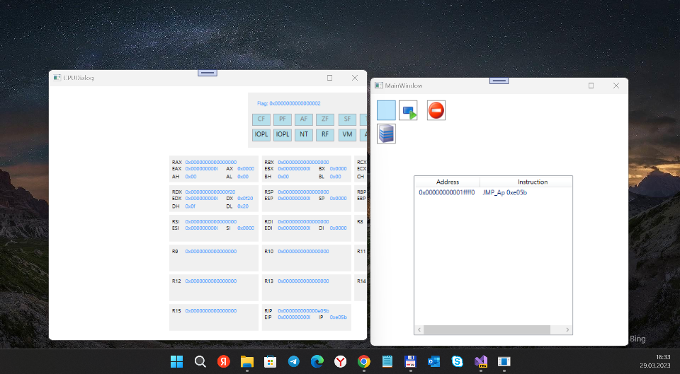

# BochsNet (Bochs.Net) 

## About
 I found the "echo" of Codeplex: https://files.olebeck.com/codeplex/
 Then I detected some strange project "Bochs.Net"... =)
 Then I downloaded it, opened via VS 2022 Preview... that's all story; enjoy the new old thing ! ;)

## Screenshots 
 

## My 2 cents
 - .NET 4.0 -> 4.8.
 - All projects seem to be compiled normally.
